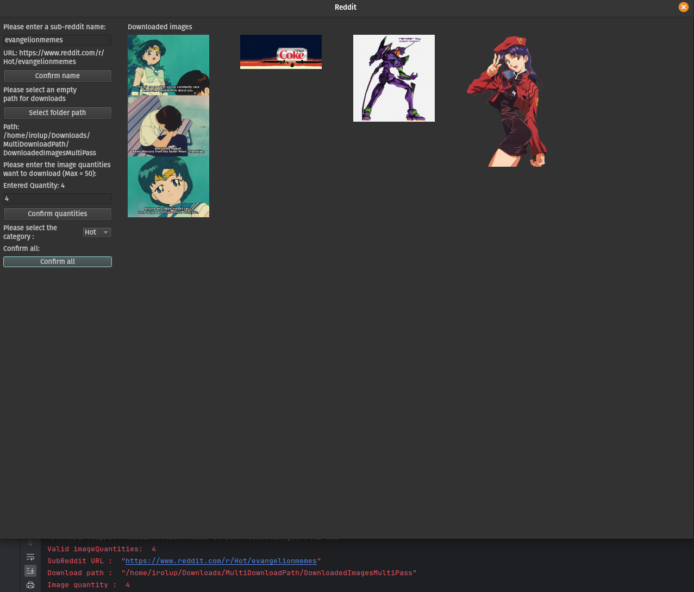

##AVERTISSEMENT
## Projet Abandonné

Ce projet n'est plus actif et n'est plus maintenu. Les fonctionnalités existantes peuvent ne plus fonctionner correctement avec les versions récentes des dépendances ou des plateformes.

# My C++ Project
This is a personal project I created on GitHub using C++. The application encompasses various functionalities.

## Features
- Download the latest images posted on a SubReddit.
- View the downloaded images in a window.
- Automatically upload images to an Instagram page (work in progress).
- Resize a user-chosen image to 480x480 pixels.
- Send the resized image to a 480x480 screen connected through the serial/COM port (work in progress).

## Motivation
I initiated this project with the aim of expanding my knowledge of C++ and web scraping. Additionally, I wanted to develop an application for personal use on Linux. The existing application for sending images or .gif files to my small 480x480 screen on my CPU cooler is incompatible with Linux.

### Screenshots
#### Download Functionality


#### Instagram Upload (Work in Progress)


#### Resize Functionality


#### Screen Send (Work in Progress)


## How to Use
To utilize this project, ensure that you have C++ installed on your machine. Additionally, install the following libraries and dependencies:

- libcurl
- nlohmann/json
- Qt

To run the project, clone the repository and compile the source code. For instance, you can use the following commands in a terminal:

```bash
git clone https://github.com/your-username/your-username.git
cd your-username
make
./your-username

License
This project is licensed under the MIT License.

